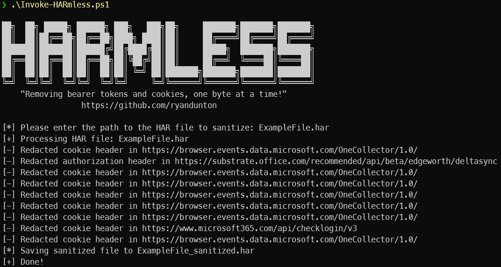

# HARmless
"Removing bearer tokens and cookies, one byte at a time"
## Description
This PowerShell script takes a HAR (HTTP Archive) file as input and removes sensitive data from its headers. The script prompts the user to input the file path if it is not provided as a parameter. The headers to be redacted are specified in a hashtable. The script then reads the HAR file, removes the sensitive data from the specified headers, and saves the sanitized HAR file with a new name.
## Usage
```
Sanitize HAR
PS C:\> .\Invoke-HARmless.ps1

With parameters
PS C:\> .\Invoke-HARmless.ps1 -HARFile ExampleFile.har -RedactWithWord REDACTED
```
